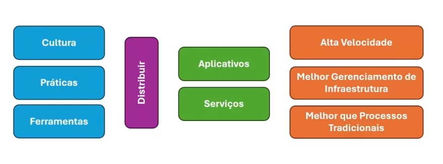
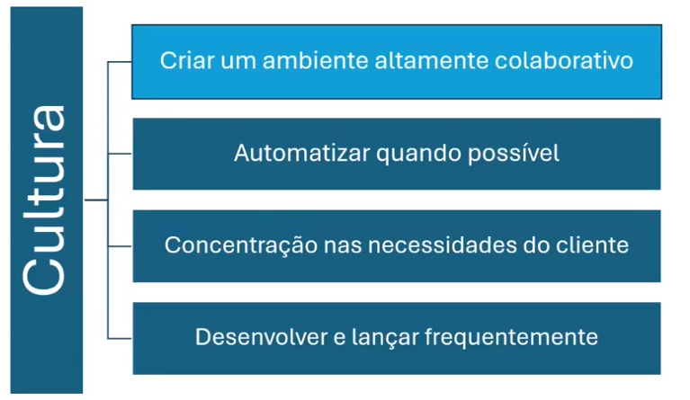
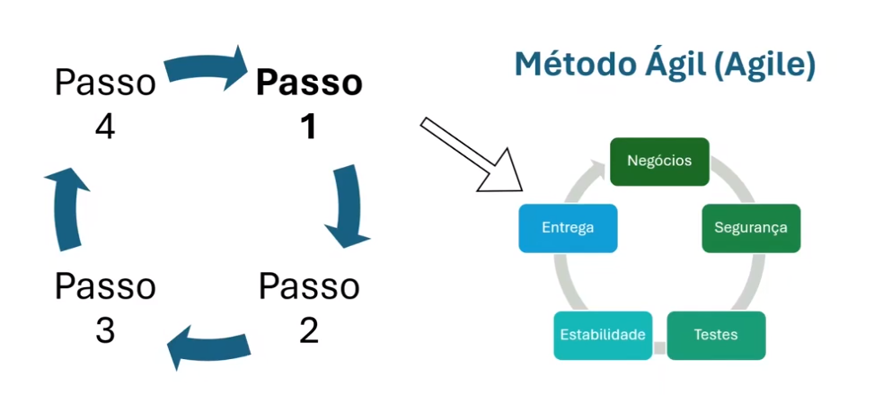
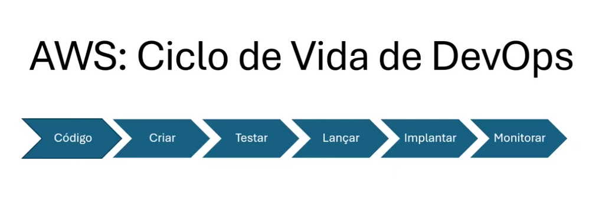
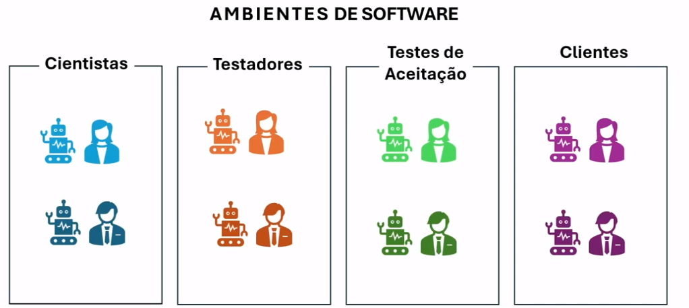
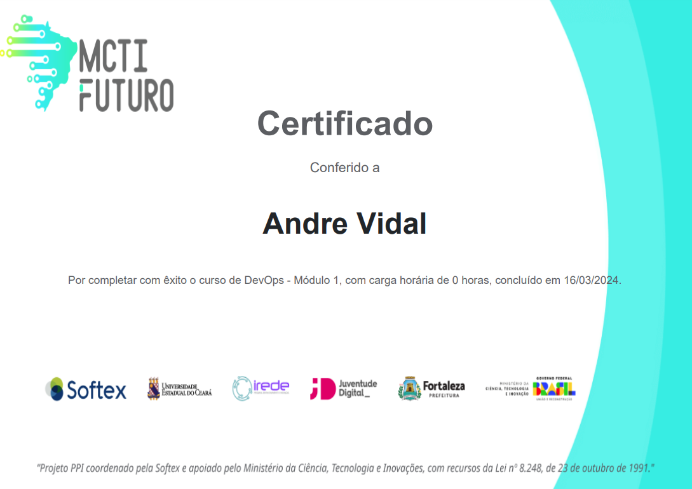

<h1>Introdução a devops</h1>

Capitulo bem highlevel do que envolve devops.

O que é devops?
O DevOps é a combinação de filosofias culturais, práticas e ferramentas que aumentam a capacidade de uma empresa de distribuir aplicativos e serviços em alta velocidade: otimizando e aperfeiçoando produtos em um ritmo mais rápido do que o das empresas que usam processos tradicionais de desenvolvimento de software e gerenciamento de infraestrutura. Essa velocidade permite que as empresas atendam melhor aos seus clientes e consigam competir de modo mais eficaz no mercado.

https://aws.amazon.com/pt/devops/what-is-devops/

<h3>Metodo Agile</h3>

<h3>Definição de Pipeline ou Ciclo de Vida</h3>

<h3>Ambientes de Software</h3>

<h3>Automação de Infra, Contêiner</h3>

