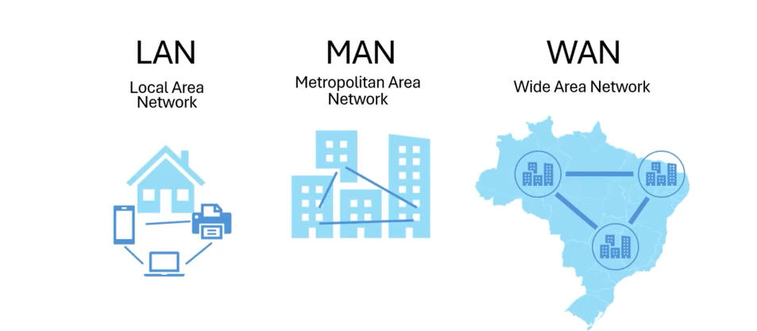
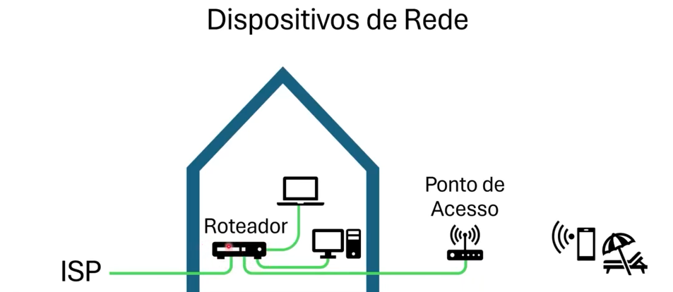
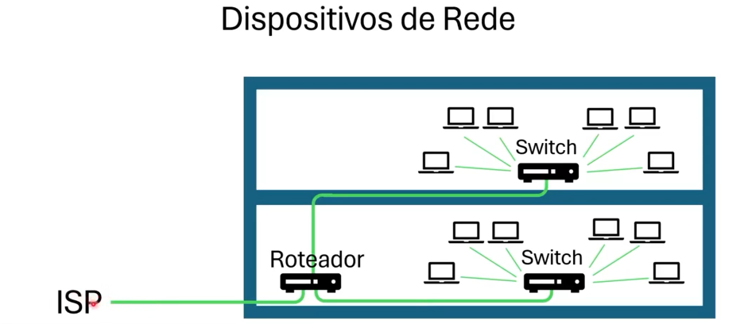
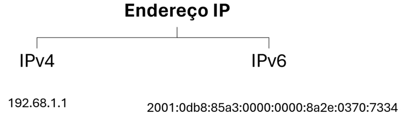
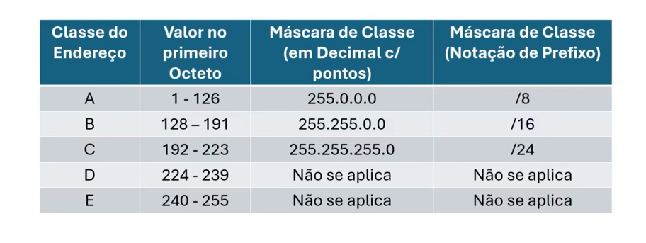
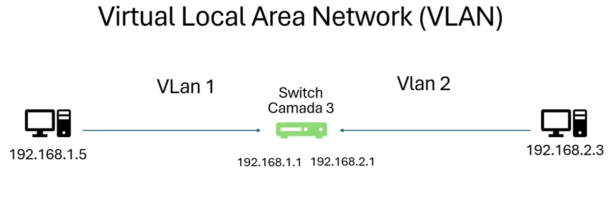
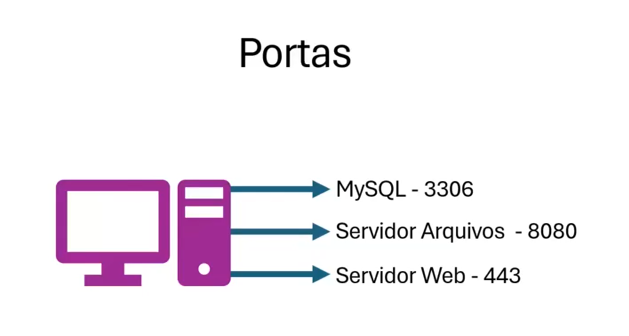

# Modulo 2 - Redes

<h3>Tipos de Redes</h3>

<h3>Dispositivos de Rede</h3>

<h3>Enderaçamento IP</h3>

<h3>Formato IPv4 e Classes de IP</h3>

<h3>Roteamento, VLAN e Firewall</h3>

<h3>Portas</h3>

