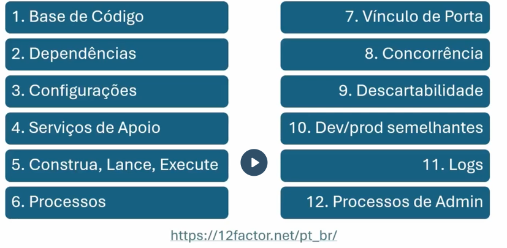
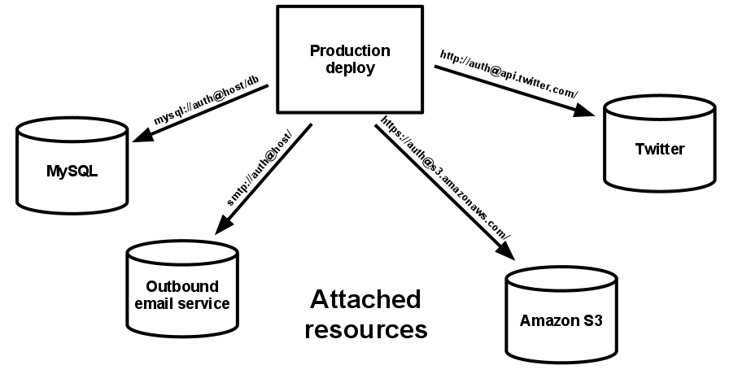
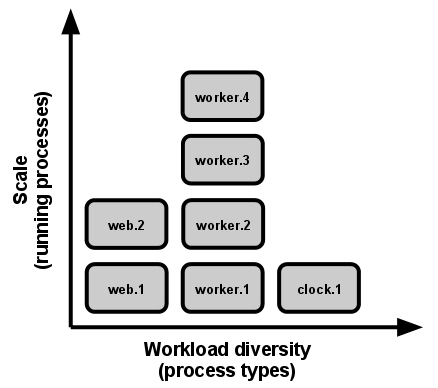

# The 12 Factor-App

<h3>Introdução aos 12 Factors</h3>

 A heroku aplicou pela primeira vez essa filosofia de desenvolvimento, onde tudo acontence de uma forma mais automatica, para isso precisamos ter guidelines bem serias que devem ser cumpridas a risca para obtermos um produto que pode ser depolyed constantemente em pequenas porçoões que são facilmente testaveis e corrigiveis, dando ao software a robustez e eslabilidades necessárias.

<h3>Fatores e DevOps</h3>

Foi usada uma metáfora com uma obra de engenharia civil para comparar com o desenvolvimento de um software, onde tudo precisa ser planejado, projetado e decido com antecedencia, com ordem e organização, prevendo os possiveis problemas e fraquezas. 

 Um das vantages dessa abordagem tambem é ser mais economica financeiramente alem de escalave, esse ponto é extremamente importante.

<h3>Escalabilidade vertical e horizontal</h3>

 A maneira mais obvia de escalar o processamento e armazenamento disponivel para uma aplicação rodar seria aumentar a potencia da maquina ex: 8gb de RAM ta pouco? Vamos trocar os pentes por um 2x de 16. Isso se chama escalar verticalmente. É facil e simple, porem nos causa uma serie de problemas, como interruptção de servico para a troca do hardware e principalmente tem um teto, tem uma hora que estaremos usando o maior pente de RAM possivel e ainda assim não sera o suficiente. Outro fator é que provedores de cloud normalmente não cobram linearmente e sim exponencialmente, ou seja, quanto mais processamento precisamos mais caro fica cada unidade de processamento, algo bem ilogico e que fere as leis do atacado... sqn!

Escalar Horizontalmente é o que a gente quer, apesar de ser um processo mais complexo, ele nos traz vantagens suficientes para justificar a camada de complexidade. Ao inves de aumentarmos o poder de uma maquina, aumentamos o numero de maquinas rodando o aplicativo ao mesmo tempo, esse processo requer outras tecnologias adjacentes para tornar tudo isso possivel; como load balancing e outras. 

<h3>1.Base de código</h3>

Uma base unica de codigo versionada unica e omnisciente, porem com deploys diferentes em ambientes diferentes a vontade.

<h3>2.Dependências</h3>

Obrigatoriamente temos que declarar explicitamente cada dependencia. 
Dependecias em uma 12factorapp maneira devem seguir dois principios, a declaracao das dependencias e o isolamento delas. Ex. python usa pip para declarar e virtualevn para isolar.
Um novo membro do time pode facilmente fazer uma copia do codigo e ter ele rodando localmente rapidamente com dependencias seguiondo esses dois principios. 

<h3>3.Configurações</h3>

O config de um app é tudo aqui que ira mudar de um deploy para o outro(stage, test, deploy, prod). Alguns exemplos são; informações de database, papelada para utilizar serviços externos (tipo os certificados e tokens para acessar um balde s3). Nesse aspecto entra muito a seriedade do dev, pois costumeramente devs colocam as configs dentro do codigo e isso é uma grande violação do 12 factor app.

<h3>4.Serviços de apoio</h3>

Todos os serviços rodam na netowork que apoiam seu funcionamento, mensagens, bancos de dados, emaisl, ou ate thirdparty APIs (twtiter, googlemaps..). 
Uma aplicação precisa ser capaz de trocar o fornecedor de um serviço sem mudar seu codigo apenas os arquivos de configuração. Ex. eu tenho que puer trocar um banco mysql por um na aws apenas mmudando as credenciais e dados nos arquivos de config.

<h3>5.Construa, lance, execute</h3>
Na metodoliga 12factorsapp, separamos completamente a construção do lançamento e da execução.
<li>Construção (build): Transformamos o codigo cru com suas dependencias em um grupo de executaveis no versionamento apropriado, comumente chamado de <b>Build</b>.
<li>Lançamento (release): Junção da build com o arquivos de configuração. Pronto para rodar em algum enviroment. 
<li>Executar (run): Arquivo pronto para ser executado junto a processos.

Existem aplicações de deployment para auxilio dessas tarefas, especialmente versionando o release e sendo capaz de dar rollback para um release estavel.

<h3>6.Processos</h3>

A execução de um aplicativo na area de execução é um processo. Isso vai do mais simples processo como:

`$ python meu_app.py`

Até uma mega aplicação com inumeros sistemas e processos rodando, todos 100% <b>STATELESS</b>. Todos os dados dinamicos devem ser armazenados em bancos externos e nunca jamais no processo.
Os processos tem seu pequeno armazenamento pessoal e filesystem, mas eles são todos efemoeros e não devem nunca contar que terão eles acessiveis de dentro numa proxima chamada.

<h3>7.Vínculo de porta</h3>

A maneira como as apps 12 factors se expoe é diferente da tradicional no sentido que não usamos um servidor externo para nos ajudar a servir nosso serviço e sim de um processo interno que funciona como um mini servidor interno da app que se conecta a uma porta de rede da maquina e deixando o serviço exposto na rede (internet mostly). Esse serviço pode usar o protocolo http ou uma infinidade de outros protocolos e até mesmo nosso proprpio backend, codigo e database. Criando assim um tipo de arquiteteura de microserviços, onode tudo é self contained.

<h3>8.Concorrência</h3>

<b>Escalar via o modelo de processos</b>  12factorsapp precisa tem seus processos modulados e capazes de rodar e escalar de forma independente e atendendo a demanda necessaria  
ex: Uma aplicação tem um processo para logar o usuario, mas um servico interno que ele esta requisitando vai ser cuidado por outro processo. Dessa forma podemos escala-los independentemente um do outr, o login pode ter 100 copias do processo enquanto o processo mais complicado interno teria 500 copias do processo.   

<h3>9.Descartabilidade</h3>

<b>Maximizando a robustez com rapida inicialização e shutdowns graciosos.</b> 
Um aplicatico segue a 12factorapp metodologia quando tem todos seus processos capazes de se terminarem de forma correta, salvando o estado local em caso necessario e tambem terminando o processo em andamento antes de inicializar um termino do processo, outra caracteristica é evitar o uso de processos longos, pois esses aumentam o risco de problemas durante o shutdown. 

A velocidade de inicialização é o segundo pilar da descartabilidade, os processos são todos capazes de se resetarem e reiniciarem em dessa forma sendo tambem automatizaveis.

<h3>10.Dev e Prod Semelhantes</h3>