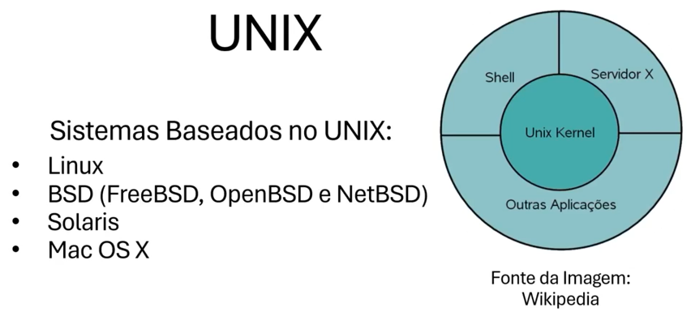
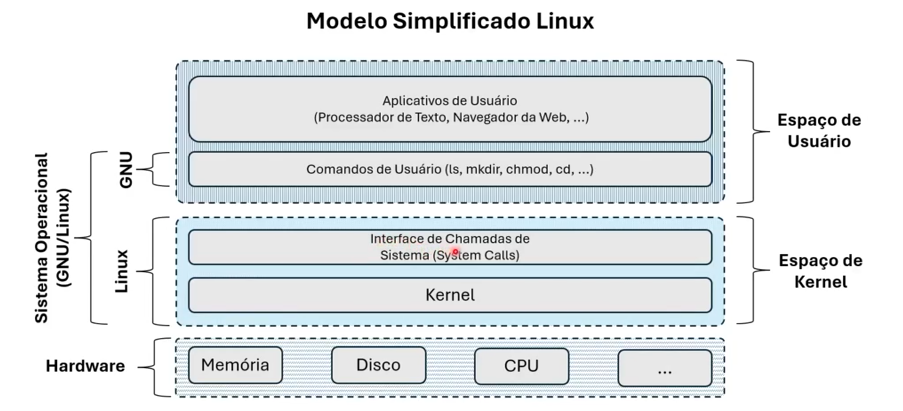
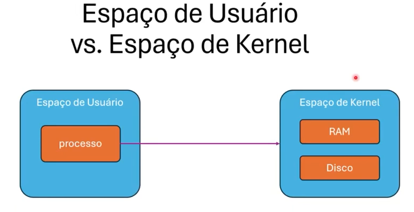
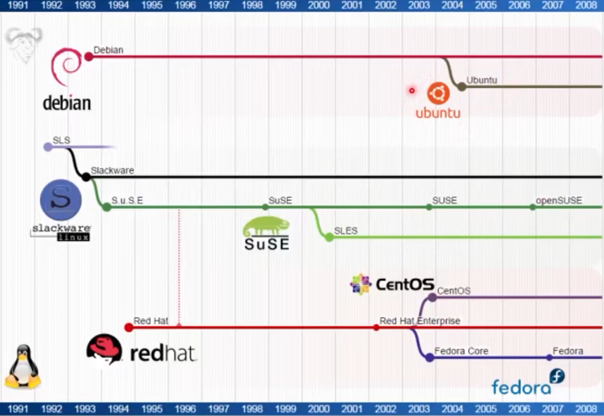
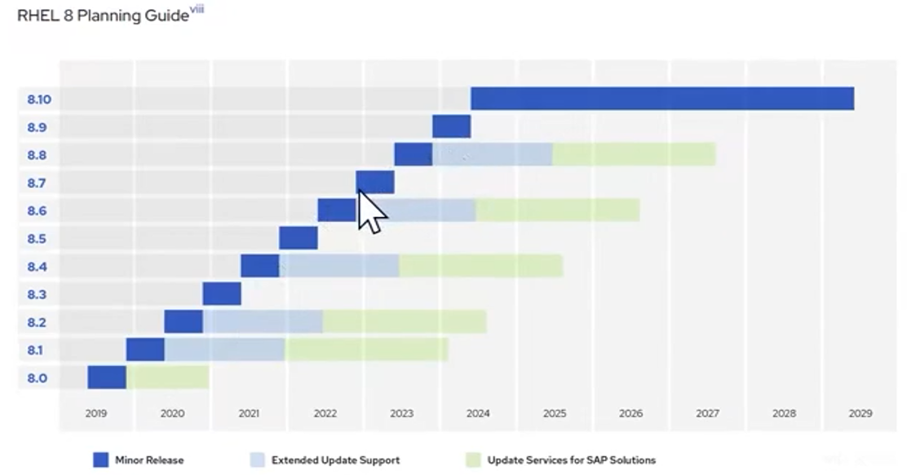

# Linux

<h3>Introdução</h3>

 xxxx
<h3>Sistemas Operacionais</h3>

É um tipo de software especial que funciona como meio de cammpo entre o usuario e o hardware.
O Linux foi feito com base no MINIX3 em 1991.

 O kernel disponibiliza todas as funções para a intereação das outras partes com o hardware.

<h3>Níveis e Revisitando Espaços</h3>

 Alto nível são linguagens que são mais proximas ao usuario, e baixo nivel são linguagens que se aproximam a maquina. 
Binario - baixo nivel 
Alexa - alto nivel

Essa separação é importantissima para o bom funcionamento do sistema. Tme que ficar claro que o Kernel tem acesso completo a todo o hardware das maquinas enquanto o espaço do usuario é um ambiente controlado onde inúmeras restrições são necessarias para a segurança do sistema. Softwares rodam no espaço do usuarios.

<h3>GNU Linux vs BusyBox</h3>

 O GNU é a suite de funcionalidades no espaço de usuario que nos ferramentas para interagir com o kernel. 
Outra dessas suites é a Busybox, que é uma alternativa menor e mais compacta do GNU, usada inclusive me containers.

<h3>Distribuições Linux</h3>

 As distros são uma coleção de software construida sobre o kernel Linux, que inclui gerenciador de pacotes, bibliotecas de software, ferramentas de usuario e apllicativos de desktop e o proprio kernel.

Cada distro é voltada para uma função especifica.

<h3>Distros para Servidores</h3>
<li> Debian: software livre mindset.

<li>Distros orientadas a containers da aws: Bottlerocket, alpine.

<h3>Gerenciadores de Pacotes</h3>

A recomendação é usar sempre os gerenciadores nbativos do sistema, deb para debians e yum/dnf para redhat.
<li> apt - .deb Debian
<li>yum - .rpm RHEL (sucessor - dnf)
<li>pacman - Arch linux (simples e eficiente)
<li>Snap - pacotes universais*
<li>Flatpak - pacotes universais**

*pontos fracos: inicializacao lenta, grandes, má integraçao com sistemas e a centralização com a store canonical.

**duplica bibliotecas, complexo de gerenciar a segurança e o suo em geral, menos pacotes disponiveis.

<h3>Ciclo de Vida de Distros</h3>

Software realmente são vivos, eles nascem, crescem e amadurecem e as vezes  morrem a qualquer momento desse ciclo.

As distros linux tambem funcionam assim, em cada fase tendo uma estrutura de criação e manutenção diferente.

Algumas distros tem suporte garantido por variados periodos de tempo, normalmente tendo versões pagas e/ou mais caras por maiores extensoes de tempo.   

 xxxx

<h3>Ciclo de Vida e Estabilidade</h3>

 Mas por que precisamos de estabilidade, pagar linux???

Em ambientes criticos como: saude, defesa, financeiro, é essencial mantermos a maior establidade e tranquilidade possivel, nesses contextos não queremos inovar e sim garantir que vai funcionar como é pra funcionar sempre todas as vezes.

<h3>Quiz</h3>

