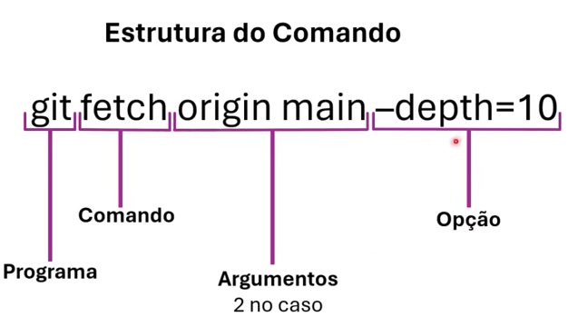

# WSL

<h3>Introdução ao WSL</h3>

 A criação do wsl pela microsoft foi uma tregua entre windows e linux que beneficou todos os desenvolvedores e profissionais de TI. Finalmente agora poderiamos criar e rodar localmente com muito mais facilidade programas em seus ambientes nativos, serjam windows ou linux.

Especialmente apos o wsl2, quando o wsl comeca a rodar o verdadeiro kernel linux, o uso do wsl virou padrão.

<h3>Importância da Linha de Comando - enhanced</h3>

 CLI nos proporciana a automação, gerenciamento, velocidade... tudo de bom. Otimização as esteiras de produção CI/CD. 
Em ambientes remotos como nuvem e containers, a CLI brilha ainda mais.
<h3>Estruturas de um Comando, Flags e Opções</h3>

<li> Os argumentos podem ser ordenados ou não.
<li> As opções precisam de valor, como um chave/valor relação.
<li> No caso de opções sem valor, chamamos de flags (essa é a diferença)

<b>Flags comuns</b>
<li>-a : all, mostra todos de algo, todos os arquivos, dirs, comandos...
<li>-v : verbose, resultados com mais detalhes
<li>-l : long, resultado com mais info de saida tambem
<li>-f : force, comando roda ignorando alguns mecanismos
<li>-r ou -R : retroactive, comando afeta subdiretoriamente
<li>-i : interactive, pede inputs do usuario antes de prosseguir    
<li>-h : help, socorro.

