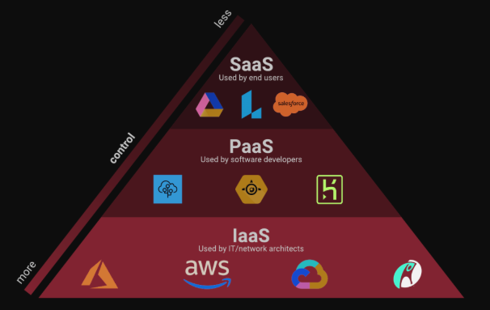

# Cloud I

**DevOps Modulo 11**

Tipos de Computação em
Nuvem: IaaS, PaaS e SaaS
Quando falamos em computação em nuvem, estamos nos referindo a uma
forma de acessar e utilizar recursos de tecnologia da informação pela internet,
sem precisar tê-los fisicamente em nossos próprios computadores. Existem
três tipos principais de serviços de nuvem: infraestrutura como serviço (IaaS),
plataforma como serviço (PaaS) e software como serviço (SaaS). Cada um
deles oferece diferentes benefícios e níveis de controle, o que permite escolher
aquele que melhor se encaixa nas necessidades específicas.

